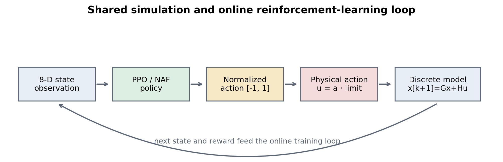
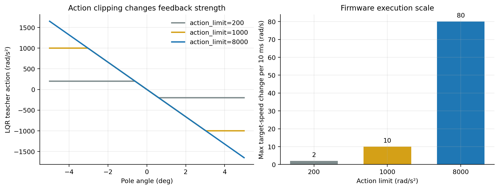
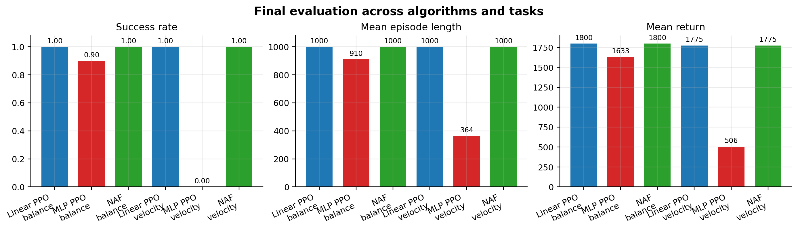
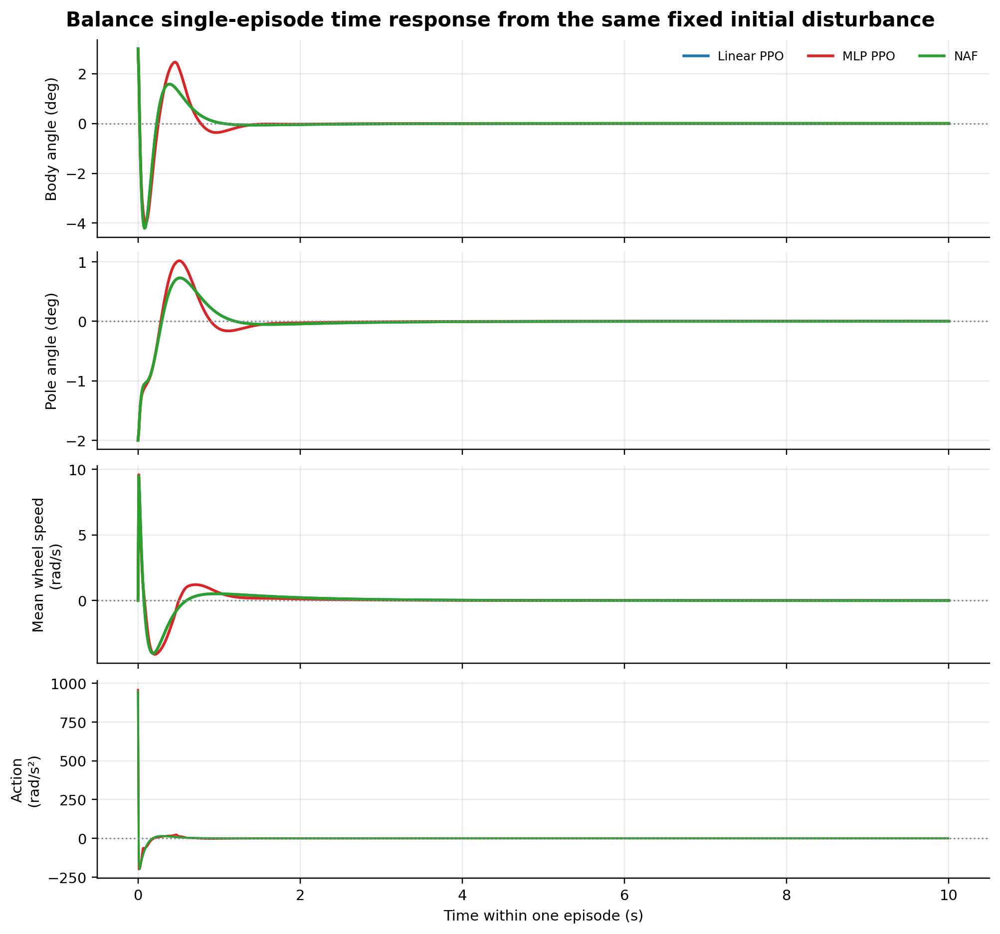
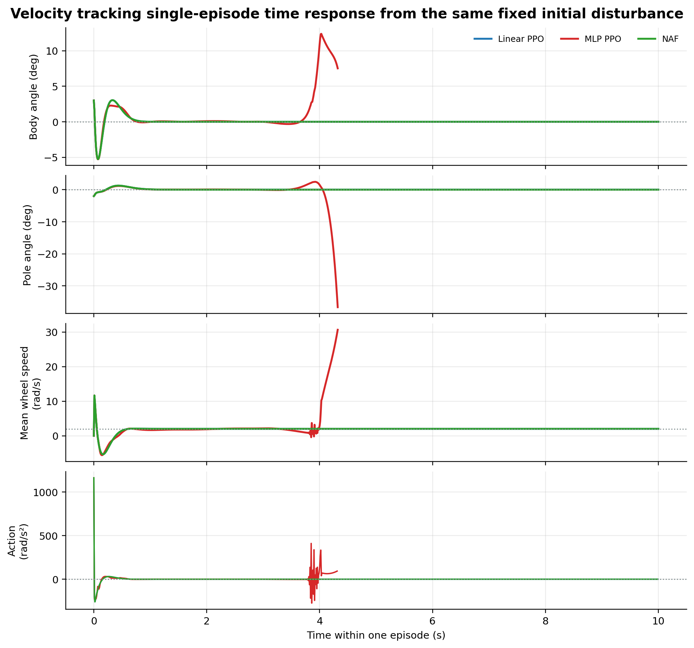
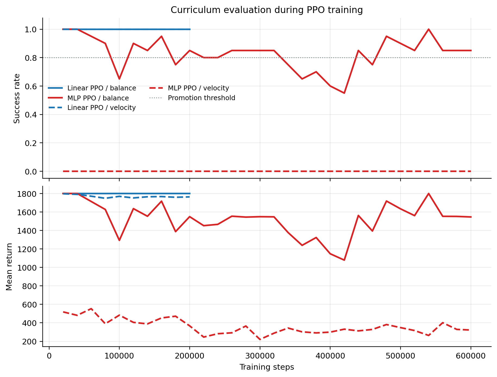
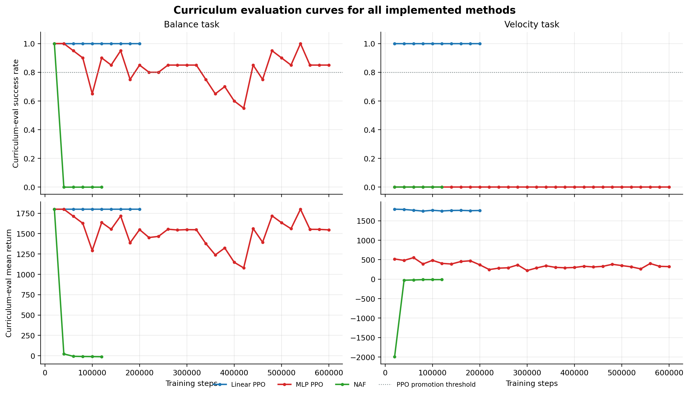
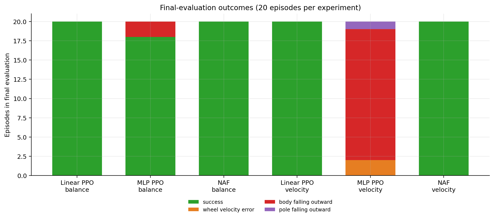

# 二阶平衡车强化学习控制技术报告

**项目：** UCSA-RL-2026-Group11  
**主题：** 基于共享仿真环境的 PPO、NAF 控制策略训练、对比与部署  
**报告日期：** 2026 年 6 月 4 日

## 摘要

本项目面向二阶平衡车的强化学习控制任务，目标是在缺少大量真实小车交互数据、真实硬件试错风险较高的条件下，搭建一套可复用的仿真训练、评估、可视化与嵌入式部署流程。项目首先建立了 8 维状态的离散线性动力学仿真环境，并将原地平衡与平衡匀速运动统一为 Gymnasium 连续控制任务。在此基础上，我们实现并比较了线性 PPO、非线性 MLP PPO 与 NAF，使用 LQR 作为稳定教师，通过精确初始化、行为克隆、课程学习、best checkpoint 恢复等方法降低训练失败概率。

实验表明，在当前小角度线性动力学模型中，线性 PPO 与 NAF 的线性 actor 更贴合任务结构：两者在原地平衡与匀速任务的 hard 难度最终评估中均达到 100% 成功率。非线性 MLP PPO 在原地平衡任务达到 90% 成功率，但在匀速任务中未能通过 easy 难度，说明增加模型复杂度并不必然提升控制效果。项目还发现，策略输出范围与固件执行尺度不匹配会导致真实小车反馈过慢。为此，训练、评估、可视化和 C 头文件导出均统一使用 `action_limit=8000 rad/s²`，使策略输出与固件中的轮角加速度控制输入保持一致。

## 1. 项目目标与总体方案

二阶平衡车同时包含车身与摆杆两个不稳定自由度。控制器需要根据轮子位置、轮速、车身姿态和摆杆姿态，在很短的控制周期内输出足够及时的反馈。直接在真实小车上进行强化学习探索存在摔倒、损坏、通信延迟和采样不稳定等风险，因此本项目采用“仿真训练为主、真实部署验证为后续目标”的技术路线。

总体流程如下：



策略观测 8 维状态，输出 1 维归一化 common-mode 动作。动作经过物理尺度映射后，同时作用于左右轮，使算法优先学习前后平衡，而不额外处理差速转向问题。

## 2. 共享仿真环境设计

### 2.1 状态、动作与任务

仿真环境 `TwoStageBalanceEnv` 使用以下 8 维状态：

```text
theta_l, theta_r, theta_l_dot, theta_r_dot,
body_angle, body_rate, pole_angle, pole_rate
```

其中，左右轮角度和角速度描述底盘运动，车身角度和摆杆角度描述两个不稳定摆的姿态。策略输出归一化动作：

```text
a ∈ [-1, 1]
```

环境将其映射为左右轮同向轮角加速度：

```text
[u_l, u_r] = [action_limit × a, action_limit × a]
```

当前环境支持两个任务：

1. `balance`：保持车身和摆杆直立，同时限制轮子漂移与轮速。
2. `velocity`：保持直立的同时跟踪固定平均轮速，当前目标为 `2.0 rad/s`。

### 2.2 动力学模型

项目使用离散线性状态空间模型：

```text
x[k+1] = G x[k] + H u[k]
```

连续时间矩阵由车轮半径、车身质量、摆杆质量、长度、重力和惯量近似构造，再通过零阶保持离散化得到 `G/H`。当前标称参数为：

| 参数 | 数值 |
|---|---:|
| 车轮半径 | 0.0335 m |
| 车身质量 | 0.9 kg |
| 摆杆质量 | 0.1 kg |
| 车身长度 | 0.126 m |
| 摆杆长度 | 0.390 m |
| 重力加速度 | 9.8 m/s² |
| 控制周期 | 0.01 s |

该模型足以支持算法开发与对比，但仍是理想化模型。真实小车中的摩擦、电机死区、传感器噪声、控制延迟、电池电压和速度 PI 响应尚未完整建模。

### 2.3 奖励函数与失败判定

奖励函数同时考虑直立程度、角速度、轮速、轮子漂移、动作幅度、动作平滑性和摔倒风险。发生失败时给予显著负奖励。环境还根据车身角度、摆杆角度、轮速和向外倾倒趋势进行终止判定。

这种设计避免策略只追求短期姿态稳定而忽略轮子高速运动，也避免策略通过剧烈抖动获得表面上的平衡效果。

## 3. 项目中遇到的主要问题与解决方法

### 3.1 问题一：随机探索极易导致训练失败

平衡车属于天然不稳定系统。策略从随机参数开始时，早期动作通常会迅速使小车摔倒，导致有效轨迹短、奖励信息少、策略难以学到稳定反馈。

**解决方法：使用 LQR 作为教师控制器。**

- 对线性 actor，直接将 LQR 控制律精确写入策略权重。
- 对 MLP actor，使用 LQR 轨迹进行行为克隆 warm start。
- 对 NAF，使用 LQR 初始化 actor，并使用教师轨迹预填充 replay buffer。

该方法不是用 LQR 替代强化学习，而是让强化学习从一个可稳定控制的初始策略出发，减少早期无效探索。

### 3.2 问题二：难度过高时策略无法稳定学习

如果一开始就在较大角度和较大角速度扰动下训练，策略容易持续失败；如果只在很小扰动下训练，策略又难以适应更强干扰。

**解决方法：使用课程学习。**

环境定义 `easy → medium → hard` 三个初始状态扰动等级。训练从 easy 开始，每隔固定步数评估当前策略；当成功率达到阈值后，自动提升到更高难度。课程学习使策略先掌握基本平衡，再逐步扩展稳定区域。

### 3.3 问题三：非线性网络参数更多，但效果反而不稳定

最初的直觉是使用 MLP 可以表达更复杂的控制规律。但当前仿真环境在小角度附近是线性状态空间模型，LQR 本身也是线性反馈律。较深网络会引入函数近似误差、训练漂移和更复杂的优化问题。

**解决方法：同时保留线性 PPO 与非线性 PPO 进行对照。**

- 线性 PPO actor：`8 → 1`，使用 LQR 精确初始化。
- 非线性 MLP PPO actor：`8 → 32 → 16 → 1`，使用 LQR 行为克隆初始化和持续行为克隆正则化。

实验结果证明，线性 PPO 在当前模型上更稳定、更高效。非线性 PPO 仍然有研究价值，因为真实小车动力学包含非线性、摩擦和饱和，但需要更充分的真实建模和训练约束。

### 3.4 问题四：训练过程并非单调改善

在部分实验中，策略初始化时已经能够稳定控制，但后续强化学习更新反而使性能下降。NAF 和 MLP PPO 日志中均能观察到成功率随训练波动甚至退化的现象。

**解决方法：保存并恢复 best checkpoint。**

训练过程中按难度、成功率和 episode 长度对策略进行评估，保存当前最佳模型。训练结束时恢复最佳 checkpoint，而不是直接使用最后一次更新后的模型。

这项机制是控制任务中的关键保护措施，因为“最后模型”不等于“最好模型”。

### 3.5 问题五：真实小车反应太慢，策略输出尺度与固件不匹配

早期策略使用 `GROUP11_U_MAX=200`。固件执行逻辑为：

```text
TargetVal = theta_dot + u × t
```

当 `t=0.01 s` 时，`u=200 rad/s²` 每周期最多只改变 `2 rad/s` 的目标轮速。对于倒立平衡，这种反馈可能过于温和，尤其是 LQR 原始控制量可能达到数百至数千量级。

**解决方法：统一训练与固件执行尺度。**

当前上车配置使用：

```yaml
action_limit: 8000.0
```

训练环境、LQR 教师、课程评估、网页可视化、模型归档和 C 头文件导出均使用同一物理尺度。新尺度允许每个 10 ms 控制周期最多改变 `80 rad/s` 的目标轮速。



需要强调的是，不能只修改导出头文件而不重新训练。策略必须在目标动作尺度下训练，否则真实执行动作会超出训练时见过的范围。

### 3.6 问题六：缺少直观的模型效果检查方式

仅查看 reward 或成功率无法直观判断模型受到扰动后的响应过程，也不利于组员协作。

**解决方法：搭建统一网页可视化。**

项目实现了 PPO 与 NAF 共用的网页仿真展示程序，支持：

- 加载训练后的模型；
- 显示小车姿态、轮速、奖励和任务信息；
- 切换 easy、medium、hard 难度；
- 手动施加大小扰动，观察抗干扰能力；
- 自动使用模型训练时保存的动作尺度。

### 3.7 问题七：训练模型无法直接用于嵌入式固件

Python 中的 Stable-Baselines3 模型包含训练期对象，不适合直接烧录 STM32。

**解决方法：导出 deterministic actor 的 C 头文件。**

导出程序仅保留 actor 的权重、偏置和前向推理函数，将归一化动作映射为物理左右轮控制量。导出结果包含统一接口：

```c
static void group11_policy_predict(const float state[8], float action[2]);
```

同时，PPO 模型文件会保存训练时的 `action_limit`，导出器自动写入 `GROUP11_U_MAX`，减少训练尺度与烧录尺度再次不一致的风险。

## 4. 算法实现与对比设计

### 4.1 线性 PPO

线性 PPO 使用 Stable-Baselines3 PPO 训练，但 actor 不包含隐藏层。策略结构为：

```text
8 维状态 → 1 维归一化动作
```

该结构与当前线性动力学和 LQR 控制律高度匹配。线性 actor 参数少、推理开销低、便于烧录，并且可以通过 LQR 精确初始化获得稳定起点。

### 4.2 非线性 MLP PPO

非线性 PPO 使用较小的 MLP：

```text
8 → 32 → 16 → 1
```

为降低训练难度，MLP PPO 使用更多 LQR 行为克隆样本、更长 warm start，并在训练过程中持续进行少量行为克隆正则化。该模型具备表达非线性控制规律的能力，但也更容易受到策略更新和函数近似误差影响。

### 4.3 NAF

NAF 是面向连续动作空间的 value-based 强化学习算法。当前 NAF actor 使用线性 `μ(s)`，价值函数相关网络使用较小 MLP。NAF 复用同一仿真环境、课程学习、LQR 教师和可视化程序，用于与 PPO 形成算法对照。

## 5. 实验设置

正式实验统一使用：

| 项目 | 设置 |
|---|---|
| 随机种子 | 11 |
| 动作上限 | 8000 rad/s² |
| 控制周期 | 0.01 s |
| 课程难度 | easy → medium → hard |
| 最终评估 episode 数 | 20 |
| PPO 学习率 | 1e-4 |
| PPO 折扣因子 | 0.995 |
| 线性 PPO 训练步数 | 200,000 |
| MLP PPO 训练步数 | 600,000 |
| NAF 训练步数 | 120,000 |

所有最终结果均来自 `outputs/logs/*_eval.csv`，课程学习曲线来自对应训练日志中的周期评估记录。单 episode 收敛响应曲线通过加载最终模型，在相同固定初始状态下进行确定性 rollout 得到。

## 6. 实验结果

### 6.1 最终评估对比



| 算法 | 任务 | 最终难度 | 成功率 | 平均长度 | 平均回报 |
|---|---|---|---:|---:|---:|
| 线性 PPO | balance | hard | 1.00 | 1000.0 | 1799.70 |
| MLP PPO | balance | hard | 0.90 | 910.0 | 1633.42 |
| NAF | balance | hard | 1.00 | 1000.0 | 1799.70 |
| 线性 PPO | velocity | hard | 1.00 | 1000.0 | 1775.22 |
| MLP PPO | velocity | easy | 0.00 | 364.2 | 505.63 |
| NAF | velocity | hard | 1.00 | 1000.0 | 1775.22 |

主要结论如下：

1. 线性 PPO 在两个任务上均达到 hard 难度 100% 成功率，说明线性策略与当前动力学模型高度匹配。
2. MLP PPO 在原地平衡任务中可以达到较好效果，但稳定性仍弱于线性 PPO。
3. MLP PPO 匀速任务未能通过 easy 难度，说明增加网络容量并未自动解决控制问题。
4. NAF 与线性 PPO 的最终结果完全一致，结合日志可推测最终最优模型主要保留了 LQR 初始化附近的稳定策略。

### 6.2 单 episode 收敛响应曲线

控制系统中更直接的“收敛曲线”是观察同一个 episode 内状态变量随时间的变化。为公平比较，本项目对线性 PPO、MLP PPO 与 NAF 使用完全相同的固定初始状态：

```text
body_angle = +3 deg
pole_angle = -2 deg
其余状态 = 0
```

rollout 使用确定性策略，不加入传感器噪声。曲线展示车身角、摆杆角、平均轮速和物理控制动作，从而可以观察响应速度、超调、震荡和是否最终稳定。

#### 6.2.1 原地平衡响应



三种方法都能将车身角与摆杆角收敛到零附近，并完成完整的 10 秒 episode。线性 PPO 与 NAF 曲线完全重合，说明两者最终保存的线性 actor 在该场景中给出了相同控制行为。MLP PPO 同样能够稳定，但车身角与摆杆角的正向超调更大，二次震荡也更明显，符合其最终成功率略低于线性方法的结果。

#### 6.2.2 匀速任务响应



线性 PPO 与 NAF 在初始姿态扰动后先产生较强纠偏动作，随后将车身角和摆杆角收敛到零附近，并将平均轮速稳定到目标值 `2 rad/s`。MLP PPO 在前约 3.5 秒内看似接近目标，但之后控制动作开始明显震荡，轮速快速增大，摆杆角发散，并在约 `4.32 s` 因 `pole_falling_outward` 终止。这比单独查看最终平均回报更清楚地展示了其失败过程。

### 6.3 PPO 课程学习过程



线性 PPO 在 20,000 步通过 easy，在 40,000 步通过 medium，此后在 hard 难度维持 100% 成功率。MLP PPO 原地平衡同样能快速进入 hard，但成功率在 0.55 至 1.00 之间波动。MLP PPO 匀速任务的成功率持续为 0，说明其问题不是简单的训练步数不足，而是策略结构、初始化、奖励或任务表达仍需调整。

### 6.4 全方法课程评估曲线



该图将当前仓库中实现的线性 PPO、MLP PPO 与 NAF 放在同一坐标系中比较。这里的曲线来自训练日志中的周期性 curriculum evaluation，不是训练 episode 的即时 reward，因此更适合衡量确定性策略在固定评估流程中的稳定性。

从曲线可以看到：

1. 线性 PPO 在两个任务上都快速达到并保持高成功率，表现最稳定。
2. MLP PPO 原地平衡可以进入 hard 难度，但性能随训练更新明显波动。
3. MLP PPO 匀速任务在整个训练过程中没有获得成功 episode。
4. NAF 当前策略在训练过程中出现明显退化。原地平衡 NAF 在 20,000 步仍为 100% 成功率，之后在 medium 难度降为 0；匀速 NAF 的周期评估成功率始终为 0。
5. NAF 最终评估仍达到 100%，不是因为最后一步策略收敛，而是训练结束时恢复了 warm start 阶段保存的 hard 难度 best checkpoint。该现象直接说明 best checkpoint 机制对当前实现非常重要。

因此，本项目中的“最终结果”与“训练中当前策略曲线”必须同时展示。只汇报最终成功率会掩盖 NAF 与 MLP PPO 的训练不稳定性。

### 6.5 最终失败原因



线性 PPO 与 NAF 在两个任务的 20 个最终评估 episode 中全部成功。MLP PPO 原地平衡有 2 次因车身向外倾倒失败。MLP PPO 匀速任务则主要因车身向外倾倒失败，同时存在轮速误差与摆杆向外倾倒问题。这说明该模型尚未形成兼顾姿态与速度目标的稳定反馈规律。

## 7. 工程结论

本项目的核心经验不是“选择一个更复杂的强化学习模型”，而是让算法、动力学、训练流程和部署尺度相互一致。

1. **控制任务需要稳定起点。** LQR warm start 显著降低了早期探索失败率。
2. **课程学习比一次性增加扰动更有效。** 它使策略逐步扩展稳定区域。
3. **模型结构应与系统结构匹配。** 当前线性环境中，线性 actor 比 MLP 更稳定。
4. **训练结果必须持续评估并保存最佳模型。** 强化学习更新可能破坏已有稳定策略。
5. **仿真尺度必须与固件尺度一致。** 动作上限过小会让真实小车表现为反馈太慢。
6. **可视化与日志同样重要。** 它们帮助定位是姿态、轮速、动作尺度还是训练波动导致失败。
7. **可部署性应在算法设计阶段考虑。** 小型线性策略和小型 MLP 更适合 STM32 推理。

## 8. 当前局限与后续工作

当前结果主要基于标称线性仿真模型，尚不能直接证明真实小车一定稳定。后续工作应包括：

1. 采集真实小车状态、动作和时间戳，拟合离散动力学 `G/H`。
2. 在仿真中加入电机死区、速度 PI、摩擦、延迟、传感器噪声和电池电压变化。
3. 使用参数随机化提升 sim-to-real 鲁棒性。
4. 检查固件输入状态是否为目标误差状态，并验证角度单位、状态顺序和正负号。
5. 在悬空安全测试中记录 `u`、目标轮速、实际轮速和 PWM，确认电机执行链能够兑现策略命令。
6. 针对 MLP PPO 匀速任务重新设计任务表达，例如将目标速度加入观测、调整奖励权重或采用残差策略。
7. 增加 SAC、TD3 等算法作为进一步对照，并统一使用共享仿真、日志、可视化和导出接口。

## 9. 复现实验与文件位置

正式训练配置位于：

```text
configs/ppo_curriculum.yaml
configs/ppo_mlp.yaml
configs/ppo_velocity.yaml
configs/ppo_mlp_velocity.yaml
configs/naf_curriculum.yaml
configs/naf_velocity.yaml
```

实验日志与结果位于：

```text
outputs/logs/
outputs/models/
outputs/firmware/
```

本报告图表与数据摘要位于：

```text
reports/group11_technical_report/figures/
reports/group11_technical_report/data/experiment_summary.csv
reports/group11_technical_report/data/curriculum_evaluation_points.csv
reports/group11_technical_report/data/episode_time_responses.csv
```

重新生成全部图表：

```bash
MPLCONFIGDIR=.mpl-cache UV_CACHE_DIR=.uv-cache uv run python \
  reports/group11_technical_report/generate_figures.py
```
